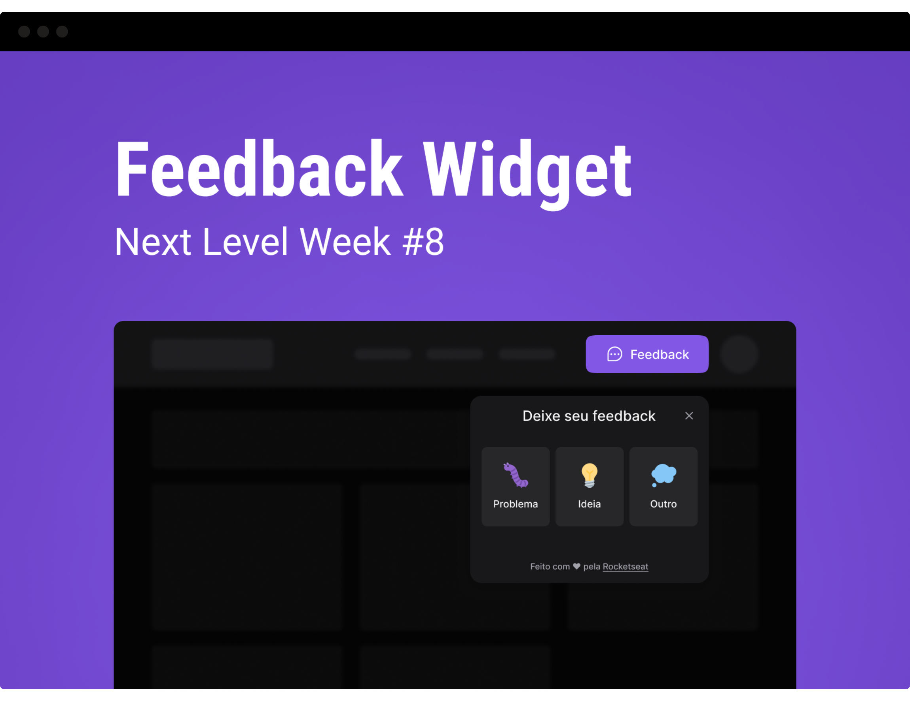

<p align="center">
  
</p>

<p align="center">
  <a href="#-tecnologias">Tecnologias</a>&nbsp;&nbsp;&nbsp;|&nbsp;&nbsp;&nbsp;
  <a href="#-como-executar">Como executar</a>&nbsp;&nbsp;&nbsp;|&nbsp;&nbsp;&nbsp;
  <a href="#-projeto">Projeto</a>&nbsp;&nbsp;&nbsp;|&nbsp;&nbsp;&nbsp;
  <a href="#-layout">Layout</a>&nbsp;&nbsp;&nbsp;|&nbsp;&nbsp;&nbsp;
  <a href="#-license">Licença</a>&nbsp;&nbsp;&nbsp;|&nbsp;&nbsp;&nbsp;
</p>

## 📑 Projeto

O Feedget é uma aplicação desenvolvida durante a Next Level Week 8 - Return - apresentado pela **[Rocketseat](https://www.rocketseat.com.br)** e responsável por coletar o feedback de usuários e
que pode ser implementada tanto no ecossistema web ou mobile. Utilizamos ferramentas e bibliotecas para tornar a navegação dentro da aplicação totalmente acessível.

## Dependências

## 🔧 Funcionalidades

- ✔️ Navegação com o Teclado
- ✔️ Envio e escolha de cada tipo de feedbacks.
- ✔️ Screenshot da tela com html2canvas
- ✔️ Uso do MailTrap para o envio de e-mails com os feedbacks

## 🧪 Ferramentas

Esse projeto foi desenvolvido com as seguintes tecnologias:

### Tecnologias

- [Node.js](https://nodejs.org)
- [React](https://reactjs.org)
- [TailwindCSS](https://tailwindcss.com)
- [Vite](https://vitejs.dev)
- [TypeScript](https://www.typescriptlang.org)
- [Express](https://expressjs.com)
- [Prisma](https://www.prisma.io)
- [PostgreSQL](https://www.postgresql.org)
- [Jest](https://jestjs.io)

### Dependências
- [Headless UI]()
- 
## 🚀 Como executar

Clone o repositório e acesse a pasta.

```bash
$ git clone https://github.com/pedrovinhas/feedback-widget
$ cd nlw8
```

Para iniciá-lo, siga os passos abaixo:

```bash
# Instalar as dependências
$ npm install

# Criar o banco de dados
$ npm prisma migrate dev

# Iniciar o projeto
$ npm run dev

# Inicie o Prisma Studio
$ npx prisma studio

# Faça uma copia do arquivo `.env.example` para `.env` e preencha com as suas credenciais
```

A aplicação pode ser acessada em [`localhost:3333`](http://localhost:3333).

## 🔖 Layout

Você pode visualizar o layout do projeto através do link abaixo:

- [Layout Web](https://www.figma.com/community/file/1102912516166573468/Feedback-Widget)

Lembrando que você precisa ter uma conta no [Figma](http://figma.com/).

## 📝 Licença

Esse projeto está sob a licença MIT. Veja o arquivo [LICENSE](LICENSE.md) para mais detalhes.

---

Feito por Pedro Henrique Vinhas 🪐
